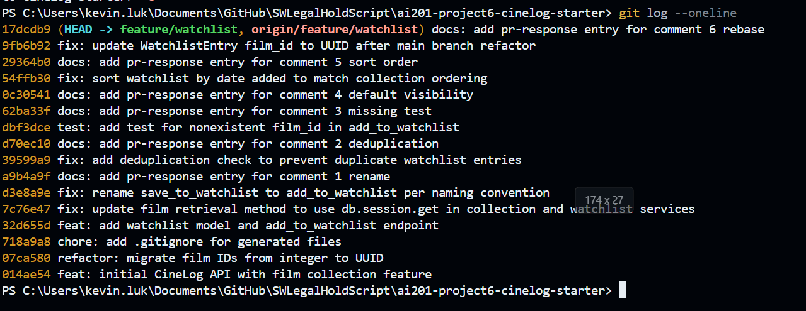

# PR Response Doc — CineLog Watchlist Feature

## AI Usage
Used Cursor (Composer) during this project for:

- **Codebase orientation:** Summarizing `models.py`, `collection_service.py`, and test patterns before addressing review comments; verified against the actual source.
- **Comment 2:** Explained how `add_to_collection()` handles deduplication so I could mirror that pattern in `add_to_watchlist()` myself.
- **Comments 4 & 5:** Drafted positions first, then used AI to stress-test tradeoffs (privacy-by-default; alphabetical findability). Final arguments in this doc are mine and grounded in CineLog’s community / watchlist-vs-collection context.
- **Comment 6 / rebase:** Helped identify the integer→UUID conflict and the “WatchlistEntry missing after rebase onto main” gotcha; I ran the git commands and force-pushed myself.
- **Milestone 4:** Checked conventional-commit format against `git log` and rewrote the starter commit message via interactive rebase.

AI was used for orientation and review of drafts, not to invent the design decisions.

## Comment 1 — Rename
**What I did:**
Renamed `save_to_watchlist()` to `add_to_watchlist()` to match the project's `verb_to_noun` naming convention (same pattern as `add_to_collection()` in `services/collection_service.py`).

Files changed:
- `services/watchlist_service.py` — function definition renamed
- `routes/watchlist/watchlist.py` — import and call site updated

**How I verified:**
Searched the entire project for `save_to_watchlist` using ripgrep (`rg save_to_watchlist`). The only remaining hits are in `specs.md`, which documents the original review comment — no references remain in application code. Ran `pytest tests/ -v` to confirm existing tests still pass.

## Comment 2 — Deduplication
**What I did:**
Added deduplication to `add_to_watchlist()` in `services/watchlist_service.py`, following the same pattern as `add_to_collection()` in `services/collection_service.py`.

Changes:
- Added `AlreadyInWatchlistError` (mirrors `AlreadyInCollectionError` in collection service)
- Before creating a new `WatchlistEntry`, query for an existing entry with the same `user_id` and `film_id`
- If a match exists, raise `AlreadyInWatchlistError` instead of inserting a duplicate row
- Updated the function docstring `Raises:` section to document the new error

Reference pattern from `add_to_collection()`:
1. Check that the film exists (`FilmNotFoundError`)
2. Query `filter_by(user_id=..., film_id=...).first()`
3. If found → raise domain-specific duplicate error
4. If not found → create and commit the entry

**How I verified:**
Ran `pytest tests/ -v` — all existing collection tests still pass. Manually traced the logic against `add_to_collection()` in `collection_service.py` (lines 47–53) to confirm the check and error behavior match. A duplicate call to `add_to_watchlist()` with the same `user_id` and `film_id` now raises `AlreadyInWatchlistError` at the service layer instead of creating a second entry.

## Comment 3 — Missing test
**What I did:**
Created `tests/test_watchlist.py` with `test_add_to_watchlist_nonexistent_film_raises`, modeled directly on `test_add_to_collection_nonexistent_film_raises` in `tests/test_collection.py` — same fixture pattern (`app`, `sample_user`), same docstring, same `fake_film_id`, same `pytest.raises(FilmNotFoundError)` assertion, calling `add_to_watchlist()` instead of `add_to_collection()`.

**How I verified:**
Ran `pytest tests/test_watchlist.py -v` — the new test passes. Ran `pytest tests/ -v` — full suite passes.

## Comment 4 — Default visibility
**My position:**
Keep `public=True` as the default on `WatchlistEntry`. This is an intentional product choice, not an accidental SQLAlchemy/`Boolean` default we forgot to think about. No code change — documenting the decision is what was requested.

**Reasoning:**
CineLog is a community film-tracking app: the product pitch is shared taste, not a private notes app. A watchlist ("want to watch later") is a social signal distinct from a collection entry (already watched/rated). Defaulting new entries to public optimizes for the common community behavior — friends seeing what you plan to watch, suggesting titles, coordinating watch-alongs — without an extra opt-in on every add. Visibility is already modeled per-entry (`public` on `WatchlistEntry`), so someone who wants a private title can flip that one film; the default only picks the path that makes the feature useful on a social platform. Collection has no visibility field at all; watchlist introduced one, so leaving it public by default is consistent with treating watchlists as shareable by design.

**Tradeoff acknowledged:**
`public=False` would optimize for privacy and least surprise — watchlists can reveal sensitive or awkward taste, and private-by-default prevents accidentally broadcasting intent-to-watch. That would better serve users who treat the list as a personal reminder queue. I prefer public here because CineLog's value is discovery; a private default would bury that unless every user opts in. Privacy-conscious users can still mark entries private; I'd reverse the default if user data showed surprise or mostly-private lists.

## Comment 5 — Sort order
**My position:**
Agree with the maintainer: sort watchlists by `date_added` descending (newest first), not alphabetical. Updated `get_watchlist()` in `services/watchlist_service.py` to match `get_collection()`.

**Reasoning:**
A watchlist is a queue of intent — "what I just saved / what's top of mind" — not a catalog you scan A–Z. Newest-first matches that use pattern: after you add a film, you expect to see it at the top. It also keeps CineLog consistent: `get_collection()` already uses `CollectionEntry.date_added.desc()`, so two "list my films" endpoints behaving differently would surprise API consumers for no strong reason. Alphabetical still helps find a specific title in a long list, but that's better as an optional client-side/`?sort=` later than as the default that diverges from collection.

**Engagement with reviewer's point:**
The reviewer said most users want to see what they added recently, and left room to disagree. I agree — for a to-watch queue, recency is the primary access pattern, not title lookup. Alphabetical would optimize the rarer "find this one film by name" case and make the watchlist the only list endpoint with a different default. I'm documenting the decision as date-added / newest first and changing the code accordingly rather than leaving alphabetical in place.

## Comment 6 — Rebase
**What conflicted:**
`main` migrated `Film.id` (and `CollectionEntry.film_id`) from integers to UUIDs (`String(36)`). The watchlist branch still had `WatchlistEntry.film_id` as `Integer`, and service/route docs still described `film_id` as an int. During rebase, `models.py` is the conflict surface: `main`'s version has UUID film IDs but no `WatchlistEntry` at all (watchlist never landed on `main`), while the feature branch has the watchlist model with the old integer FK.

**How I resolved it:**
Updated models to the post-refactor shape and kept watchlist on top of it:
- `Film.id` / `CollectionEntry.film_id` → `String(36)` (match `main`)
- Re-added / kept `WatchlistEntry` with `film_id = db.Column(db.String(36), db.ForeignKey("film.id"))`
- Updated `add_to_watchlist` docstring and the watchlist route body note from int → UUID string
- Nonexistent-film test already used a UUID fake id (`00000000-0000-0000-0000-000000000000`), same as collection

**How I verified no conflict remains:**
After `git rebase origin/main`:
- `git log --merges origin/main..HEAD` is empty (linear history, no merge commits)
- `models.py` has no integer `film_id` / `Film.id` left
- `pytest tests/ -v` passes with UUID film IDs

## PR Description
*(Also paste into the GitHub PR: `feature/watchlist` → `main`.)*

### What this feature does
Adds a **watchlist** to CineLog: films a user wants to watch later, separate from their collection (films already watched). Includes the `WatchlistEntry` model, `add_to_watchlist` / `get_watchlist` service functions, and REST endpoints:

- `GET /watchlist/<user_id>` — list the user’s watchlist (newest first)
- `POST /watchlist/<user_id>/add` — add a film (`{ "film_id": "<uuid>" }`)

Adds are deduplicated (`AlreadyInWatchlistError`), unknown films raise `FilmNotFoundError`, and each entry has a per-entry `public` visibility flag. Film IDs are UUIDs after rebasing onto the main refactor.

### Design decisions
1. **Default visibility: `public=True`.** Watchlists are public by default so CineLog’s community features (friends seeing what you plan to watch) work without an opt-in every time; users can still mark individual entries private. See Comment 4.
2. **Sort order: `date_added` descending.** Watchlists sort newest-first, matching `get_collection()` and the “just saved / queue of intent” use case, instead of alphabetical. See Comment 5.

### How to manually test
1. Install and start:
   ```bash
   pip install -r requirements.txt
   python app.py
   ```
   (Browsing `/` returns 404 — expected; this is a JSON API.)
2. Create a user and film, print IDs:
   ```bash
   python -c "from app import create_app, db; from models import User, Film; app=create_app();
   ctx=app.app_context(); ctx.push(); u=User(username='demo', email='demo@example.com'); f=Film(title='Arrival', year=2016); db.session.add_all([u,f]); db.session.commit(); print(u.id, f.id)"
   ```
3. Exercise the API (replace `USER_ID` / `FILM_ID`):
   ```bash
   curl -X POST http://127.0.0.1:5000/watchlist/USER_ID/add -H "Content-Type: application/json" -d "{\"film_id\": \"FILM_ID\"}"
   curl -X POST http://127.0.0.1:5000/watchlist/USER_ID/add -H "Content-Type: application/json" -d "{\"film_id\": \"FILM_ID\"}"
   curl -X POST http://127.0.0.1:5000/watchlist/USER_ID/add -H "Content-Type: application/json" -d "{\"film_id\": \"00000000-0000-0000-0000-000000000000\"}"
   curl http://127.0.0.1:5000/watchlist/USER_ID
   ```
   Expect: first add succeeds; duplicate fails; fake UUID not found; GET returns newest first.
4. Or run: `pytest tests/ -v`

### Commit history screenshot
`git log --oneline origin/main..HEAD` on `feature/watchlist` (linear, conventional commits, no merge commits):



